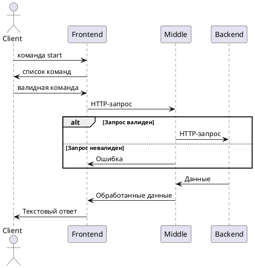

# lukina-telegram-bot

Мини-банк.Представляет телеграм-бот, который предоставляет список возможных команд для операций со счетами.
Возвращает результат в текстовом виде.

## Архитектура
### Frontend (java/kotlin)
Клиентское приложение. Инициирует запросы пользователей.
### Middle layer (java/kotlin)
* Принимает запросы от tg-бота
* Выполняет валидацию и бизнес-логику
* Маршрутизирует запросы в backend
### Backend (java/kotlin)
Автоматизированная банковская система
* Обрабатывает транзакции
* Хранит клиентские данные

